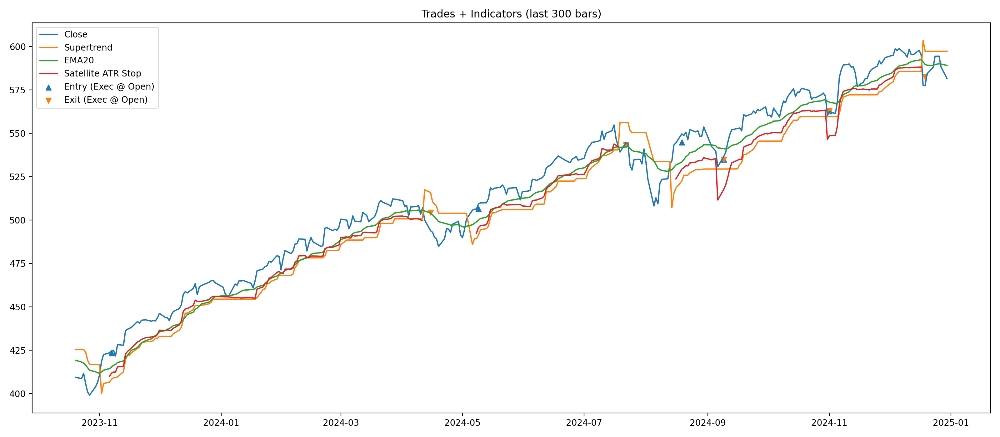

# Risk-Adjusted Strategy Analysis (SPY)

## Executive Summary

Developed a modular Python backtesting framework to evaluate a risk-managed core + satellite allocation strategy on SPY.

The strategy reduced maximum drawdown by more than 50% and lowered volatility by ~40% compared to buy-and-hold, while improving the Sharpe ratio.

---

## Strategy Overview

- Asset: SPY (S&P 500 ETF)  
- Data: Daily (yfinance)  
- Period: 2020-01-01 → 2024-12-31  
- Allocation:
  - Core (30%): Always invested  
  - Satellite (70%): Tactical long-only allocation  

---

## Satellite Logic

**Entry**
- Bullish Supertrend flip  
- Breakout above reversal high  
- Volume confirmation for re-entry  

**Exit**
- Bearish Supertrend flip  
- OR hybrid trailing stop (whichever triggers first):
  - ATR-based trailing stop  
  - 15% trailing stop from highest close  
- Stop exit confirmed only when momentum weakens (Close < EMA20)

---

## Training Results

Initial Capital: $10,000

| Metric | Strategy | Buy & Hold |
|--------|----------|------------|
| Final Value | $16,533 | $19,126 |
| CAGR | 10.71% | 14.05% |
| Max Drawdown | -13.80% | -33.72% |
| Annual Volatility | 12.43% | 21.09% |
| Sharpe Ratio | 0.88 | 0.73 |
| Satellite Trades | 20 | — |
| Time in Market | 59.94% | — |

---

## Visual Results

### Equity Curve

### Drawdown Comparison

### Trade Visualization

---

## Project Structure

src/
  data.py        → data ingestion
  indicators.py  → Supertrend, ATR, EMA
  signals.py     → entry/exit logic + hybrid stop
  backtest.py    → next-day execution engine
  metrics.py     → performance metrics
  plots.py       → visualization
main.py          → pipeline runner

---

## Key Takeaways

- Reduced max drawdown by more than 50% vs buy-and-hold  
- Lower volatility with improved Sharpe ratio  
- Moderate trade frequency (20 trades over 5 years)  
- Regime filtering reduced exposure during adverse trends  

---

## Next Improvements

- Parameter sensitivity analysis  