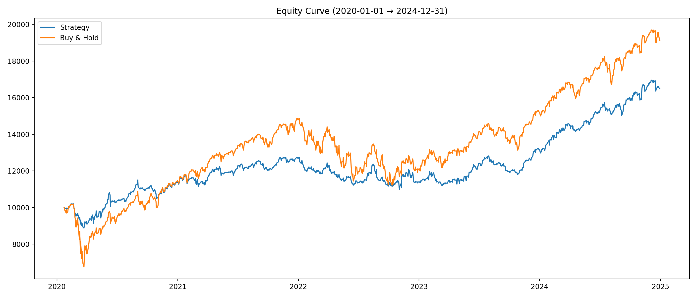
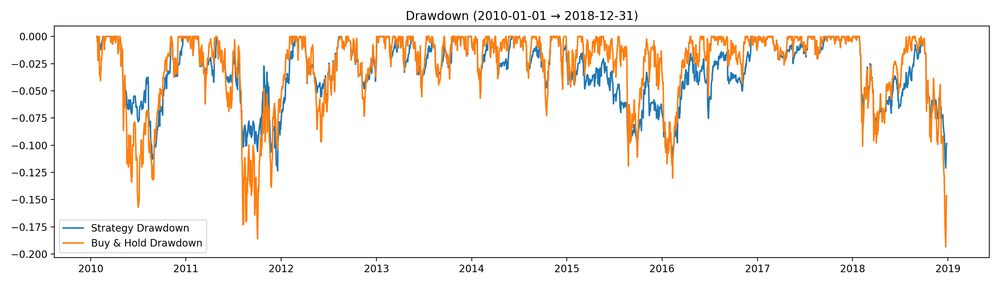

# Risk-Adjusted Strategy Analysis (Python)

This project builds a Python framework to test a rule-based investment strategy using historical market data.

The goal is to compare a **risk-managed strategy** against a simple buy-and-hold approach and understand the trade-off between **return and risk (drawdowns)**.

---

# Strategy Idea

The portfolio is split into two parts:

- **Core (30%)**: Always invested in the market  
- **Satellite (70%)**: Actively enters and exits based on signals  

This means the portfolio is always between:

- 30% invested (defensive)
- 100% invested (bullish conditions)

---

# Entry Conditions

The strategy enters when:

- Trend turns bullish (Supertrend indicator)
- Price breaks above a recent high
- Volume is above average

---

# Exit Conditions

The strategy exits when:

- Trend turns bearish, OR
- Price hits a trailing stop

A momentum filter (EMA20) is used to avoid exiting on small fluctuations.

---

# Backtest Assumptions

- Initial capital: $10,000  
- Execution: Next-day open  
- Portfolio valued at daily close  
- Transaction costs:
  - Commission: 0.05%
  - Slippage: 0.05%

---

# Project Structure

```text
risk-adjusted-strategy-analysis/
├── main.py                # Single run
├── train_test.py          # Train/test evaluation
├── multi_asset_test.py    # Runs across multiple assets
├── src/
│   ├── data.py
│   ├── indicators.py
│   ├── signals.py
│   ├── backtest.py
│   ├── metrics.py
│   └── plots.py
└── outputs/
```

# How to Run

Install dependencies:

```bash
pip install -r requirements.txt
```

Run:

```bash
python main.py
python train_test.py
python multi_asset_test.py
```

# Results (SPY)

### Train (2010–2018)

| Metric | Strategy | Buy & Hold |
|-------|---------|------------|
| CAGR | 6.49% | 11.32% |
| Sharpe | 0.69 | 0.79 |
| Max Drawdown | **-12.37%** | -19.35% |

---

### Test (2019–2024)

| Metric | Strategy | Buy & Hold |
|-------|---------|------------|
| CAGR | 12.30% | 17.18% |
| Sharpe | **1.02** | 0.90 |
| Max Drawdown | **-14.67%** | -33.72% |  

---

# Visualizations

### Equity Curve


### Drawdown


# Key Takeaway

The strategy:

- Reduces drawdowns significantly  
- Improves risk-adjusted returns (Sharpe)  
- Trades less (~60% time in market)  
- Underperforms buy-and-hold in total return  

---

# What This Project Shows

- Data cleaning and processing  
- Building a modular Python pipeline  
- Designing rule-based systems  
- Evaluating performance using metrics like CAGR, Sharpe, and drawdown  

---

# Notes

This is not meant to be a production trading system.  
It is a project to explore how different rules affect risk and return.
